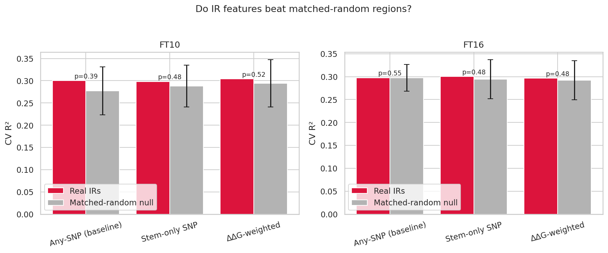
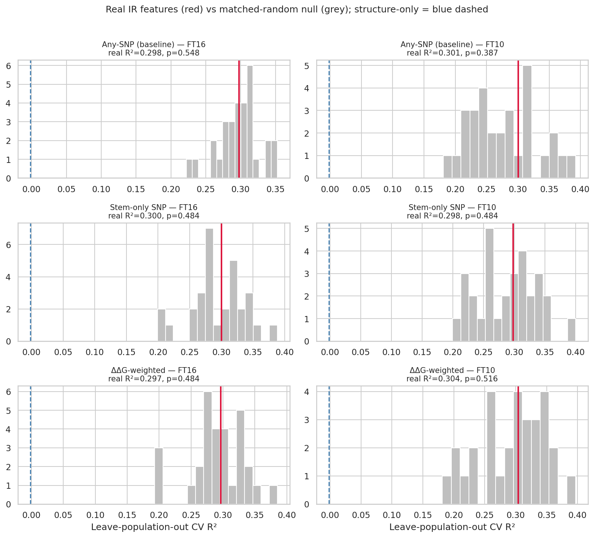
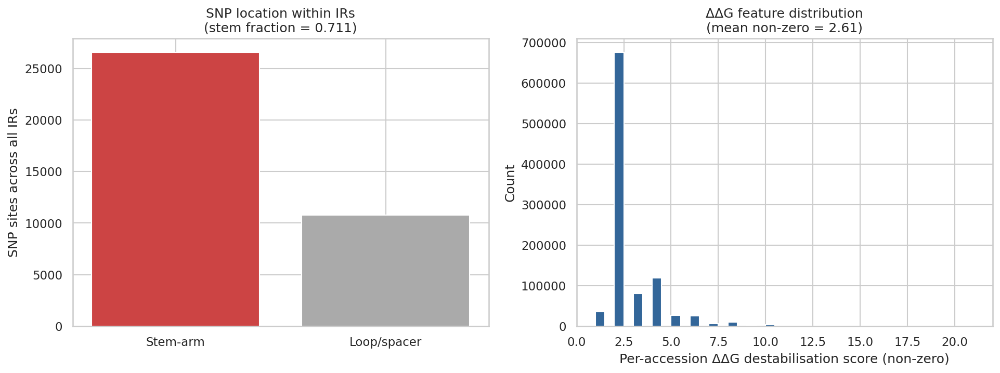

# Experiment 01 — Do inverted repeats carry phenotype signal beyond random regions?

**Date:** 2026-06-03
**Status:** Complete
**Verdict:** ❌ No IR-specific signal — not even with mechanistic, biology-aware features.

---

## Question

Earlier work showed that a binary "any SNP in the region = disrupted" IR fingerprint
predicts flowering time at R² ≈ 0.30, but so does any matched set of random genomic
regions — i.e. the signal is generic linked-variant signal, not inverted-repeat biology.

That feature was crude: it counts a SNP in the hairpin **loop** (which disrupts nothing)
the same as a SNP that **breaks a stem base pair** (which destabilises the structure).
This experiment asks the fair version of the question:

> When IR disruption is modelled **mechanistically** — only stem-breaking SNPs, weighted
> by base-pair stability — do inverted repeats predict flowering time better than matched
> random regions, under proper population-structure control?

## Data

| Component | Value |
|---|---|
| Reference | TAIR10 Chr1 (30.4 Mb) |
| Inverted repeats | 6,642 (IUPACpal, stems ≥14 bp, ≤1 mismatch, gap ≤50) |
| Genotypes | 1001G imputed SNP matrix (Chr1: 2,597,825 SNPs) |
| Phenotypes | AraPheno study 12 — flowering time FT10 (n=1003), FT16 (n=970) |
| Kinship | 1001G IBS matrix → population structure |

## Features compared

For an IR at `[start, end)` with stem length *S*, stem arm position *k* pairs the left
base `start+k` with the right base `end-1-k`.

| Feature | Definition | Biology captured |
|---|---|---|
| **Any-SNP** (baseline) | binary: disrupted if ≥1 SNP anywhere in `[start, end)` | none — location overlap only |
| **Stem-only SNP** | binary: disrupted only if a SNP falls in a **stem arm** (loop/spacer SNPs ignored) | a loop SNP doesn't break the hairpin |
| **ΔΔG-weighted** | continuous: Σ over disrupted stem pairs of a stability weight (G:C = 3, A:T = 2) | thermodynamic cost of breaking each pair |

The features are demonstrably meaningful, not degenerate (see diagnostics figure below):
**71% of SNPs inside IRs fall in stem arms** (26,580 stem vs 10,799 loop/spacer sites), so
the stem-only filter genuinely changes the feature; the ΔΔG score distribution peaks at
2–3, i.e. single A:T / G:C pair disruptions.

## Method

- **Matched-random null.** Each IR is relocated to a random genomic position with its
  geometry (stem/spacer/length) preserved, and the *same* feature extraction is applied.
  30 relocations build a null distribution of CV R². This isolates whether IR **locations**
  matter, holding the feature definition constant.
- **Leave-population-out CV.** Accessions are clustered into populations from kinship-PCoA
  axes; `GroupKFold` holds out whole populations, so a model cannot exploit within-population
  relatedness. A pure population-structure baseline (kinship axes only) is reported for context.
- **Model.** RandomForest (100 trees), R² via out-of-fold predictions.
- **Empirical p-value** = fraction of null region-sets whose R² ≥ the real IR R².

## Results

| Feature | Trait | Real IR R² | Null R² (mean ± sd) | Null max | p | Structure-only R² |
|---|---|---|---|---|---|---|
| Any-SNP | FT16 | 0.298 | 0.297 ± 0.029 | 0.353 | 0.55 | ≈0 |
| Any-SNP | FT10 | 0.301 | 0.277 ± 0.054 | 0.392 | 0.39 | ≈0 |
| Stem-only | FT16 | 0.300 | 0.294 ± 0.043 | 0.389 | 0.48 | ≈0 |
| Stem-only | FT10 | 0.298 | 0.288 ± 0.047 | 0.400 | 0.48 | ≈0 |
| ΔΔG-weighted | FT16 | 0.297 | 0.292 ± 0.043 | 0.385 | 0.48 | ≈0 |
| ΔΔG-weighted | FT10 | 0.304 | 0.294 ± 0.053 | 0.397 | 0.52 | ≈0 |

**No feature beats its matched-random null** (all p ≈ 0.39–0.55). Real IRs sit in the dead
centre of the null distribution in every case.

### Real IRs vs matched-random regions

Red (real IRs) and grey (matched-random) bars are statistically indistinguishable for all
three features, in both traits.

### Null distributions (red = real IR, grey = null, blue dashed = structure-only)

The real-IR R² (red) falls squarely within the random-region null (grey) in all six panels.
The structure-only baseline (blue, ≈0) confirms the ~0.30 predictivity is real linked-variant
signal — but it is present in *any* genomic binning, IR or not.

### Feature sanity / ΔΔG illustration

## Interpretation

At the resolution of *"which IRs are disrupted"*, **inverted repeats on Chr1 carry no
flowering-time signal beyond matched random regions** — and this holds even after upgrading
the feature from crude region-overlap to stem-only disruption and to a ΔΔG-weighted
destabilisation score. The mechanistic refinements changed the feature (71% of the action is
in stems) but did **not** change the verdict.

The predictive signal that exists (R² ≈ 0.30) is generic: random region-sets capture it
equally well because any dense genomic binning tags the causal/linked flowering-time variants
that survive leave-population-out CV. The IR framing adds nothing on top.

### Why this negative result is trustworthy
- **Matched null** controls for region count and length distribution.
- **Leave-population-out CV** removes the kinship confound (structure-only R² ≈ 0).
- **Three escalating feature definitions** all agree — the result is not an artefact of a
  weak feature.
- The features are verified non-degenerate (diagnostics) and unit-tested.

## Limitations

- **Chr1 only.** Genome-wide IRs (esp. organellar-derived or specific functional classes)
  are untested. More IRs add power, but would need to overturn a very flat null.
- **Binary genotypes.** The imputed matrix encodes alt-allele presence, not the alt base, so
  "stem SNP ⇒ broken pair" is an approximation (true ΔΔG would need the alt allele + folding).
- **Disruption ≠ structure.** We test SNP-level disruption of IRs, not IR copy-number,
  methylation, or expression — other routes by which IRs could matter.
- **Population imbalance.** Kinship clustering is dominated by one large group (855/1003);
  the matched-null comparison is robust to this (same CV for real and null), but absolute R²
  values are CV-scheme dependent.

## Next steps (if pursuing the IR hypothesis further)

1. **Genome-wide scan** (all 5 chromosomes) — power check against the flat null.
2. **Allele-aware ΔΔG** — extract alt alleles for stem positions from the annotated VCF and
   fold per-accession hairpins (ViennaRNA) for a true ΔG, rather than the pair-weight proxy.
3. **Functional-class IRs** — restrict to IRs in promoters/UTRs or known regulatory contexts
   instead of all genomic IRs, where a structural effect is more plausible.
4. **Different phenotypes** — flowering time is highly polygenic/structure-linked; a trait
   with known local-structure determinants may behave differently.

---

*Reproduce:* `python experiments/mechanistic_experiment.py`
*Raw results:* [`experiment-01-results.csv`](experiment-01-results.csv),
[`experiment-01-diagnostics.json`](experiment-01-diagnostics.json)
