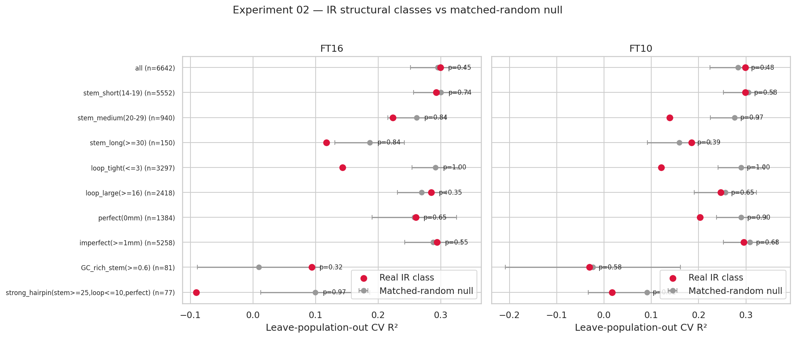
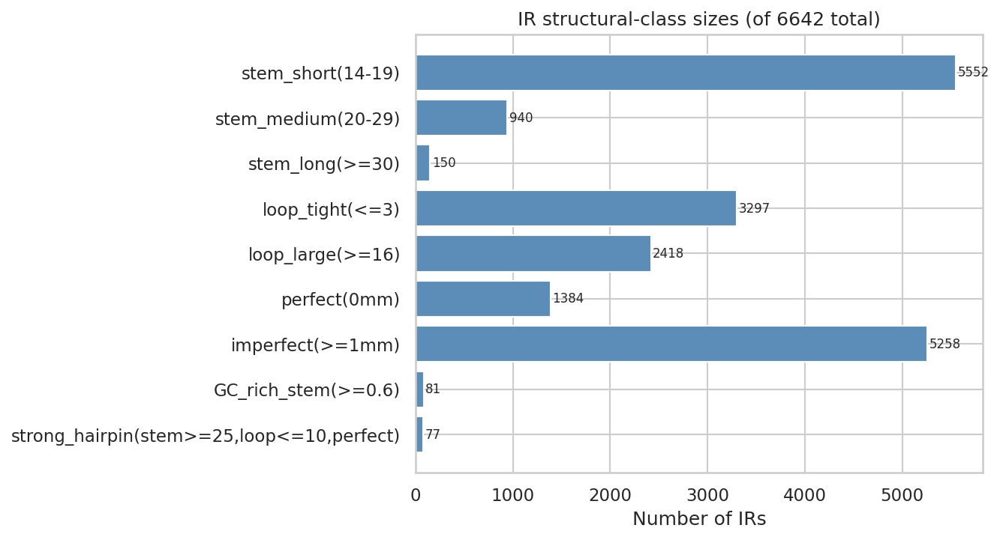

# Experiment 02 — Do specific structural classes of IR carry signal?

**Date:** 2026-06-04
**Status:** Complete
**Verdict:** ❌ No structural class beats its matched-random null (min p = 0.32).

---

## Question

Experiment 01 lumped all 6,642 IRs together and found no IR-specific flowering-time
signal. Maybe a **functional subset** does. IUPACpal's geometry lets us slice IRs by
stem length, loop size, mismatch count (degeneracy), and stem GC — so we test each
structural class against its own matched-random null under leave-population-out CV.

Hypothesis: a structurally distinct class — e.g. **long, perfect, tight-loop hairpins**,
the strongest cruciform formers — carries signal even though the bulk of IRs do not.

## Method

Same harness as Exp 01: per-class **stem-only** disruption fingerprint, matched-random
null (each IR relocated with geometry preserved, 30 sets), RandomForest under
leave-population-out CV (`GroupKFold` over kinship-PCoA populations). Empirical p =
fraction of null sets with R² ≥ the real class R². Mismatches and GC are recomputed
from the reference (the BED stores only stem/loop length).

## Results

| Class | n IRs | FT16 p | FT10 p |
|---|---|---|---|
| all | 6642 | 0.45 | 0.48 |
| stem_short (14–19) | 5552 | 0.74 | 0.58 |
| stem_medium (20–29) | 940 | 0.84 | 0.97 |
| stem_long (≥30) | 150 | 0.84 | 0.39 |
| loop_tight (≤3) | 3297 | **1.00** | **1.00** |
| loop_large (≥16) | 2418 | 0.35 | 0.65 |
| perfect (0 mm) | 1384 | 0.65 | 0.90 |
| imperfect (≥1 mm) | 5258 | 0.55 | 0.68 |
| GC_rich_stem (≥0.6) | 81 | 0.32 | 0.58 |
| strong_hairpin (stem≥25, loop≤10, perfect) | 77 | 0.97 | 0.81 |

**No class beats its matched null.** Several do *worse* than random regions of the same
geometry: tight-loop IRs (p = 1.00) and the strong-hairpin class (real R² actually
**negative**, −0.09 on FT16) sit below their nulls. The most biologically plausible
cruciform formers are, if anything, the least predictive.

## Interpretation

Stratifying inverted repeats by structural class does **not** rescue a flowering-time
signal. The result from Exp 01 is robust to slicing: it is not that we averaged away a
strong subset — no subset stands out. Smaller classes have lower R² simply from having
fewer features (their nulls drop in step), so the flat comparison holds throughout.

## Limitations

- Stem-only binary disruption (no allele-aware ΔG); same caveat as Exp 01.
- Mismatch recomputation is not IUPAC-aware, so ~3% of IRs overlapping ambiguity codes
  may be misfiled between perfect/imperfect — too small to change the verdict.
- Chr1 only.

## Conclusion

Combined with Exp 01, the per-locus IR-disruption hypothesis is rejected at three levels
(crude, mechanistic, and structural-class). The next experiments change the *context*
(regulatory annotation, Exp 03) and the *target* (gene expression) rather than continuing
to refine a per-locus disruption feature.

---
*Reproduce:* `python experiments/structural_classes_experiment.py` ·
*Raw:* [`experiment-02-results.csv`](experiment-02-results.csv)
