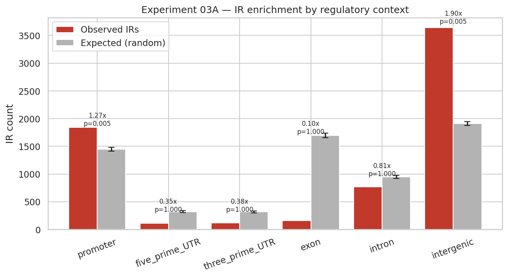
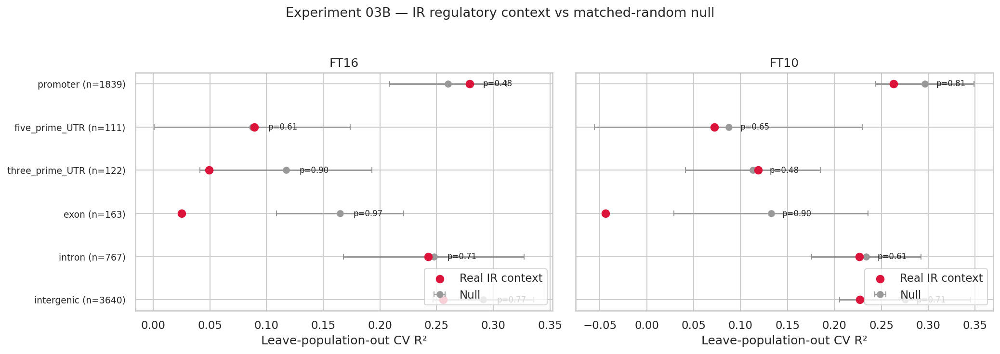

# Experiment 03 — Regulatory context of inverted repeats

**Date:** 2026-06-04
**Status:** Complete
**Verdict:** ✅ **Positive genome finding** — IRs are non-randomly distributed across
regulatory contexts (depleted in coding, enriched in promoters/intergenic).
❌ Context-stratified disruption still does **not** predict flowering time.

---

## Questions

- **(A) Genome knowledge.** Are IRs *enriched* in regulatory regions relative to random
  placement? IRs in promoters can form cruciforms that modulate transcription, so
  positional enrichment there would be biologically meaningful independent of phenotype.
- **(B) Phenotype link.** Does disruption of IRs in a specific context (e.g. promoter IRs
  only) predict flowering time better than matched-random regions?

Each IR is assigned one context by its midpoint, in priority order:
`promoter (≤1 kb upstream of TSS) > 5'UTR > 3'UTR > exon/CDS > intron > intergenic`
using the TAIR10 GFF3 (Chr1: 7,156 genes).

## (A) Enrichment — a real, non-random signal

| Context | Observed | Expected (random) | Fold | p |
|---|---|---|---|---|
| **Promoter** | 1,839 | 1,446 | **1.27× enriched** | **0.005** |
| **Intergenic** | 3,640 | 1,912 | **1.90× enriched** | **0.005** |
| Exon / CDS | 163 | 1,697 | **0.10× — strongly depleted** | 1.00 |
| 5′UTR | 111 | 320 | 0.35× depleted | 1.00 |
| 3′UTR | 122 | 319 | 0.38× depleted | 1.00 |
| Intron | 767 | 948 | 0.81× depleted | 1.00 |

(Null = 200 random relocations preserving each IR's length; enrichment p = fraction of
random sets with ≥ observed count.)

**Inverted repeats are purged from protein-coding exons (~10× depleted) and significantly
enriched in promoters and intergenic DNA.** This is the signature expected under purifying
selection against structure-forming palindromes inside genes, with tolerance/retention in
regulatory and non-coding regions. It is a genuine, phenotype-independent piece of genome
biology recovered by the pipeline.

## (B) Context-stratified prediction — still null

| Context | n IRs | FT16 p | FT10 p |
|---|---|---|---|
| promoter | 1839 | 0.48 | 0.81 |
| five_prime_UTR | 111 | 0.61 | 0.65 |
| three_prime_UTR | 122 | 0.90 | 0.48 |
| exon | 163 | 0.97 | 0.90 |
| intron | 767 | 0.71 | 0.61 |
| intergenic | 3640 | 0.77 | 0.71 |

**No context beats its matched null** (min p = 0.48). Even promoter IRs — the enriched,
biologically plausible set — do not predict flowering time above random regions.

## Interpretation

A clean dissociation:

- IRs are **functionally constrained and non-randomly placed** (Exp 03A) — they "know"
  about gene structure.
- But **which IRs a given accession has disrupted by SNPs does not track flowering time**
  (Exp 01, 02, 03B), in any structural class or regulatory context.

The most likely reason: flowering time is dominated by a few large-effect loci (FRI/FLC,
mostly off Chr1) and genome-wide population structure. Per-locus IR disruption is a diffuse,
high-dimensional feature with no special claim on those determinants — so under honest
leave-population-out CV it cannot out-predict random regions. The signal IRs *do* carry is
**structural/regulatory**, not allelic-disruption-vs-organismal-trait.

## Next steps

This motivates the remaining two directions, which finally match feature to where IR signal
should live:

- **Direction 3 — gene expression target.** Relate promoter/5′UTR-IR disruption to the
  *expression of the adjacent gene* (cis), where a local cruciform effect is mechanistically
  plausible and not swamped by trait-wide polygenicity.
- **Direction 4 — population-aware IUPAC IRs.** Use IUPACpal's IUPAC-encoding to catalogue
  IRs that are robust vs fragile across the population; the enrichment result above suggests
  promoter/intergenic IRs are the constrained set to focus on.

---
*Reproduce:* `python experiments/regulatory_context_experiment.py` ·
*Raw:* [`experiment-03-results.csv`](experiment-03-results.csv),
[`experiment-03-enrichment.csv`](experiment-03-enrichment.csv)
