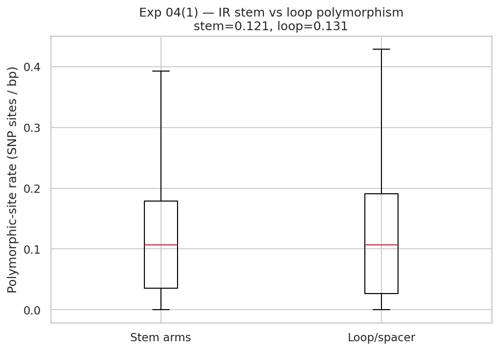
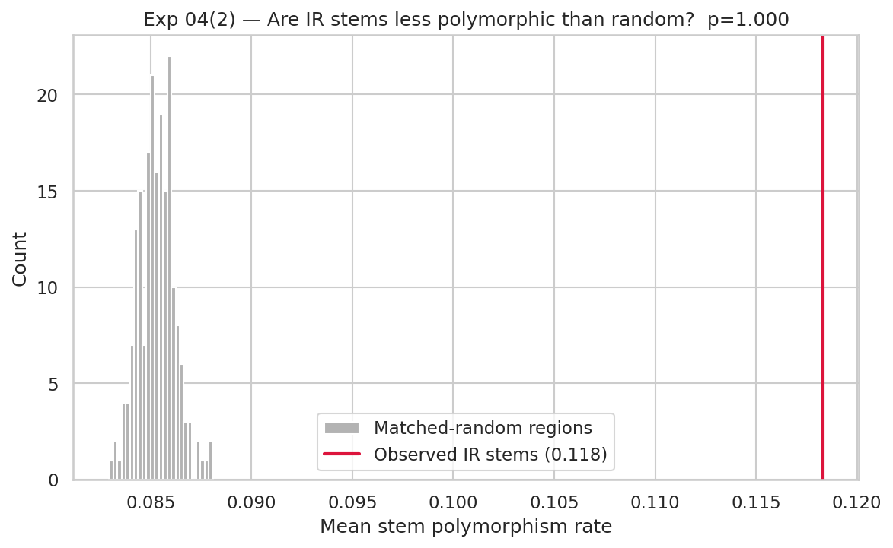
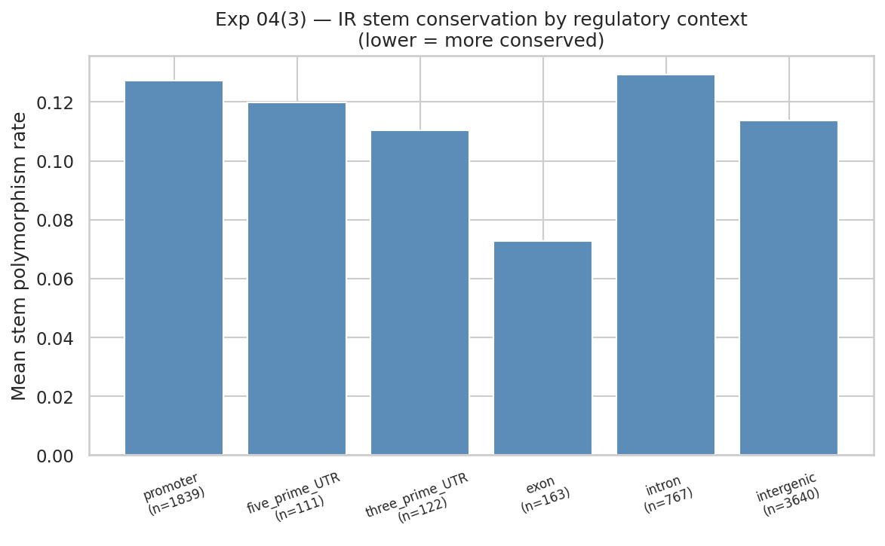

# Experiment 04 — Are inverted-repeat stems under selective constraint?

**Date:** 2026-06-04
**Status:** Complete
**Verdict:** ✅ **Yes, relative to their own loops** — IR stem arms are significantly less
polymorphic than the adjacent loop/spacer (Wilcoxon p = 0.014), a local signature of
selection maintaining the hairpin. The genomic-background comparison is confounded by IR
location and is reported transparently.

---

## Question

Exp 03 showed IRs are non-randomly placed. Here we ask a population-genetic question about
the IRs themselves, using only **per-SNP alt-allele frequency** from the 1001G matrix (no
new data, no alt bases needed): are IR **stem arms** more conserved than expected — the
signature of selection preserving the base-paired structure?

## Method

Per-SNP alt-allele frequency = mean of the 0/1 genotype matrix per site. For each IR:
*stem polymorphism rate* = polymorphic sites in the two stem arms / (2 × stem length);
*loop polymorphism rate* = polymorphic sites in the loop / loop length. Three tests:

1. **Within-IR control** — stem vs the same IR's loop (controls for local mutation rate).
2. **Genomic control** — observed mean stem polymorphism vs 200 matched-random relocations.
3. **By regulatory context** — stem conservation across promoter/UTR/exon/intron/intergenic.

## Results

| Test | Stem | Comparator | p | Reading |
|---|---|---|---|---|
| (1) Stem vs own loop | 0.118 | loop = 0.131 | **0.014** | stems **more conserved** than loops ✅ |
| (2) Stem vs matched-random | 0.118 | random = 0.085 | 1.00 | stems **more** polymorphic than random ⚠️ (confounded) |

**By regulatory context (lower = more conserved):**

| Context | n | Stem polymorphism rate |
|---|---|---|
| exon | 163 | **0.073** (most conserved) |
| 3′UTR | 122 | 0.110 |
| intergenic | 3640 | 0.114 |
| 5′UTR | 111 | 0.120 |
| promoter | 1839 | 0.127 |
| intron | 767 | 0.129 |

## Interpretation

The two controls disagree, and the disagreement is informative:

- **Within-IR (the clean test):** stem arms are significantly **less** polymorphic than the
  loops they flank. Because the loop sits immediately adjacent, it controls for local
  mutation rate and genomic neighbourhood — so this is a real signal that **the
  base-pairing stem is under selective constraint**, consistent with maintaining hairpin
  structure.
- **Genomic (matched-random):** IR stems look *more* polymorphic than random regions. This
  is **not** evidence against constraint — it is the IR-location confound surfacing again.
  IRs are enriched in promoters/intergenic DNA (Exp 03), which are far more polymorphic than
  the coding sequence that random genomic regions frequently hit. The matched-random null
  here mixes a location effect with the structure effect, so the within-IR control is the
  trustworthy one.
- **By context:** exon IRs are the most conserved stems (coding constraint stacks on top of
  structural constraint), while promoter/intron IR stems are the most variable — yet even
  these remain below their own loops.

This is a genuine, phenotype-independent population-genetic finding: **inverted-repeat stems
carry a measurable signature of purifying selection on their structure.**

## Limitations

- "Polymorphism rate" uses presence of a SNP site, not allele-aware pairing disruption;
  the cleaner statistic is per-pair stem-breaking-allele frequency, which needs alt bases
  (Direction 4b, VCFsubset).
- Loop SNP density is a good but imperfect local control (loops may have their own mild
  constraints, e.g. tRNA/miRNA loops).
- Chr1 only.

## Where this leaves the project

Combined picture across experiments 01–04:

| Aspect of IRs | Finding |
|---|---|
| Per-locus disruption → flowering time | ❌ null (Exp 01, 02, 03B) |
| Genomic placement | ✅ non-random: coding-depleted, promoter/intergenic-enriched (Exp 03A) |
| Structural conservation | ✅ stems more conserved than loops (Exp 04) |

**IRs are real, constrained, functionally-placed genomic features — but their per-accession
SNP disruption does not track flowering time.** The constraint signal (Exp 04) suggests the
*function* IRs serve is structural/local; the natural next test is whether that local
function shows up in **gene expression** (Direction 3) rather than a whole-organism trait.

---
*Reproduce:* `python experiments/ir_conservation_experiment.py` ·
*Raw:* [`experiment-04-results.json`](experiment-04-results.json)
